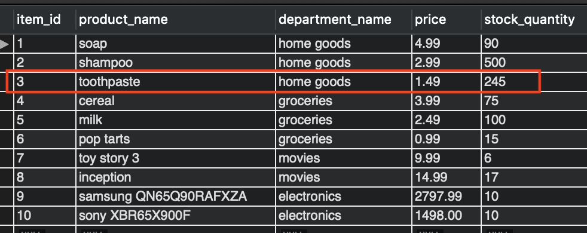

# Bamazon

## Table of Contents

- [What is this thing](https://github.com/bernardericschubert/bamazon#what-is-this-thing)
- [Application Details](https://github.com/bernardericschubert/bamazon#application-details)
- [In Action](https://github.com/bernardericschubert/bamazon#in-action)
    - [Functionality](https://github.com/bernardericschubert/bamazon#functionality)
- [Technologies](https://github.com/bernardericschubert/bamazon#technologies)

## What Is This Thing

Bamazon is a CLI Node.js application that allows users to query a database of products and "purchase" them

## Application Details

The application stack is simple.  It is built using Node.js on top of a MySQL database.  The database was created from scratch and a small number of products were inserted.  When invoking the application via command line, a dump of product data will be returned.  Users can then choose a product and quantity of that product for purchase.  If the stock on hand exceeds the desired quantity, the application will complete the purchase by signaling success to the user and the total purchase cost.  On the back-end, the application will decrease stock on hand in the database.  If stock on hand is lower than desired quantity, the application will signal an error to the user.

## In Action

The CLI is straight-forward.  *Command Line: node bamazonCustomer.js*

**To get started, you'll need to ensure the following packages are installed:**
1. **Inquirer:** Inquirer is a collection of common interactive command line user interfaces.  In this application it is used to prompt the user with questions and save their answers.

     *Command Line: npm install inquirer*

2. **MySQL:** This is a node.js driver for mysql. It is written in JavaScript, does not require compiling, and is 100% MIT licensed.

     *Command Line: npm install mysql*

Read more about these packages [here](https://www.npmjs.com/)

### Functionality

1. Product listing

    

    

    

2. Choose a product

    User is prompted to enter an ID and a quantity.  If stock on hand exceeds quantity desired the purchase is successful.

    

    Upon successful purchase, the application will update the quantity in the database.  Notice the decreased quantity for ID:3 compared to the starting amount above

    

    

    If quantity exceeds the available amount in the database, an error is returned

    

    

## Technologies

- Node.js
- MySQL

